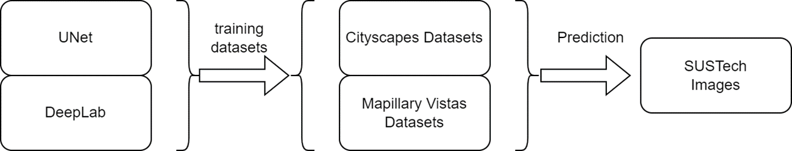

<h1 align = "center">Semantic Segmentation for autonomous driving</h1>

11911612 Haoyu Wang

12012524 Zhangjie Chen

12011923 Xudong Zhang

12011231 Yuxuan Li

## 1. Background

​	Autonomous driving, also known as self-driving or driverless technology, represents a revolutionary advancement in the automotive industry. It involves vehicles capable of navigating and operating without human intervention. Autonomous vehicles leverage a combination of sensors, cameras, radar and artificial intelligence to perceive their environment and make real-time decisions, enabling them to navigate roads independently. The development of autonomous vehicles is based on key elements, including environmental perception, data processing, path planning, and control systems. These elements work cohesively to ensure a safe and comfortable autonomous driving experience.

​	Environmental perception is a pivotal function in autonomous driving, focusing on vehicles' ability to interpret and understand its surrounding. However, the uncertainty in environmental states creates challenges for autonomous driving systems. Factors like unpredictable road conditions and dynamic scenarios require advanced perception technologies to adapt and make accurate decisions.

​	In order to meet the challenges, we apply semantic segmentation for environmental perception. Semantic segmentation is a perception method that categorizes pixels in an image into different semantic classes, such as road, pedestrians, vehicles, and obstacles, enabling the vehicle to understand its environment. The primary purpose of semantic segmentation in autonomous driving is to provide a detailed understanding of the surrounding environment, aiding decision-making processes for self-driving vehicles.

## 2. Motivation

​	Semantic segmentation is a crucial process for the environmental perception of autonomous driving, involving associating each pixel of an image with predefined class.  In this task, we will apply U-net model to complete semantic segmentation.

​	U-Net is a popular architecture for semantic segmentation. The down/up-sampling technique became an important design idea and later was adopted by AIGC as well. Although initially designed for biomedical applications, its powerful performance goes beyond. U-net can be trained end-to-end from very few images and outperforms the prior best method (a sliding-window convolutional network) on the ISBI challenge for segmentation of neuronal structures[^1]. To effectively leverage label information, we will use the fully-supervised batch contrastive approach, which will pull clusters of points belonging to the same class together in embedding classes while pushing apart clusters of samples from different classes[^2].

​	Meanwhile, in order to improve the performance under the situation without any human labels, an approach, named Cut-and-LEaRn (CutLER) will be used for training unsupervised object detection and segmentation models. CutLER first generate coarse masks for multiple objects in an image and then learns a detector on theses masks using robust loss function[^3].

## 3. Existing Methods

### 3.1 U-Net

​	U-Net is one of the early algorithms that utilizes fully convolutional networks for semantic segmentation. It aims to identify cell boundaries in images, and its innovation lies in the symmetrical U-shaped structure, comprising a compressive path and an expansive path. The nomenclature of the network is derived from the U-shaped configuration it exhibits. The compressive and expansive paths conduct max-pooling downsampling and transposed convolution operations, respectively, culminating in a two-dimensional segmentation map, as the task at hand pertains to binary classification. The inventive design of U-Net had a discernible impact on the subsequent development of several segmentation networks. 

​	Due to the substantial memory consumption of model weights, particularly when employing a very large batch size, a significant portion of GPU memory is allocated for this purpose, resulting in considerable GPU memory wastage. Consequently, the U-Net team opted for larger individual images with a batch size set to 1. However, this choice introduces a challenge where gradient estimation becomes highly dependent on a single image, leading to increased noise. To address this issue, a high momentum value is employed, ensuring that early training samples exert a considerable influence on the gradient descent process. 

​	The experiments conducted with U-Net utilized a relatively straightforward ISBI cell tracking dataset. Given the inherently uncomplicated nature of the task, U-Net achieved remarkably low error rates by training on only 30 images, complemented by the implementation of data augmentation strategies.

### 3.2 DeepLabv3+

​	DeepLabv3+ is an advanced semantic segmentation model developed by Google, building upon the DeepLab series. This model is designed for pixel-level image segmentation, where each pixel in an image is assigned a semantic label. Below is a brief overview:

1. **Architecture Evolution:**
   - DeepLabv3+ extends its predecessor, DeepLabv3, by incorporating an encoder-decoder structure. This architecture enhances the model's ability to capture both global contextual information and detailed features.
2. **Atrous Spatial Pyramid Pooling (ASPP):**
   - ASPP is a key component of DeepLabv3+ that captures multi-scale contextual information. It utilizes atrous convolutions at different rates to gather information at varying receptive field sizes, improving segmentation performance.
3. **Atrous Separable Convolution:**
   - The model employs atrous separable convolution, a technique that helps reduce computation while maintaining expressive power. It enhances the efficiency of the convolutional layers.
4. **Feature Cross-Attention:**
   - Some variants of DeepLabv3+ introduce feature cross-attention, addressing challenges in semantic segmentation by incorporating attention mechanisms to refine feature representations.
5. **Encoder-Decoder Structure:**
   - The encoder-decoder structure aids in better feature extraction and semantic understanding. The encoder captures high-level features, while the decoder refines the segmentation output.
6. **Applications:**
   - DeepLabv3+ finds applications in image segmentation tasks, including object recognition, scene understanding, and medical image analysis.

## 4. System Setup and Problem Statement

## 5.Proposed Method I and Results

### 5.1 Datasets

#### - Cityscapes Dataset gtFine

The [Cityscapes Dataset](https://www.cityscapes-dataset.com/) focuses on semantic understanding of urban street scenes:

​	The dataset contains about 3000 pixel-level segmented pictures and 30+ object classes.

#### - Mapillary Vistas Dataset v1.2

​	The [Mapillary Vistas Dataset](https://www.mapillary.com/dataset/vistas/) is a diverse street-level imagery dataset with pixel‑accurate and instance‑specific human annotations for understanding street scenes around the world.

​	The dataset contains over 18000 pixel-level segmented pictures and 60+ semantic object categories.

#### - Self-labeled SUSTech Dataset

​	Self sampled SUSTech dataset contains images of street scenes in Southern University of Science and Technology, which are totally collected by our group members.

​	The mask are labeled with LabelMe. Due to the heavy workload, the dataset only contains 30+ pictures and 30+ object categories and is supposed to be used for evaluating models.

### 5.2 U-Net Model

**Extending U-Net for Multi-Class Classification**

​	In adapting U-Net for multi-class classification, a fundamental modification involves extending its architecture to accommodate the intricacies of multiple classes rather than the binary segmentation it was initially designed for (background and foreground).

​	For the transition to multi-class segmentation, a pivotal adjustment is made in the output layer, necessitating an increase in the number of channels. Specifically, each class requires a dedicated channel for prediction. For example, in a scenario with 5 classes, the output layer is expanded to incorporate 5 channels, with each channel dedicated to predicting the presence and characteristics of a specific class. This expansion enables the model to provide nuanced and class-specific segmentation outputs, allowing it to discern and delineate between different objects or entities within the input data. This modification empowers U-Net to extend its utility beyond binary segmentation tasks and lends itself effectively to the demands of multi-class classification challenges.

### 5.3 Experiment

#### Experiment Design

​	We plan to train multiple models on different dataset. In our experiment, we trained two models separately on cityscapes dataset and mapillary vistas dataset. After that, the models are compared in terms of accuracy, IoU of categories.

#### Experiment Platform Detail

​	We conducted the experiment based on the server with following info provided by course:

| Tool                | Detail/Version                            |
| ------------------- | ----------------------------------------- |
| GPU                 | NVIDIA GeForce RTX 2080 Ti                |
| CPU                 | Intel(R) Xeon(R) Gold 5218R CPU @ 2.10GHz |
| CUDA                | 12.2                                      |
| python              | 3.7                                       |
| pytorch+torchvision | 1.13.1/0.14.1                             |
| tensorboardx        | 2.2                                       |

#### Model Training

​	We trained our model with the following parameters, which has been adjusted based on the feature (size, number of categories):

##### On Cityscapes Dataset

| Parameters         | Explanation                                           | Values  |
| ------------------ | ----------------------------------------------------- | ------- |
| batch size per GPU | Train batch size(Modified according to different GPU) | 4       |
| epochs             | Number of epochs during training                      | 100     |
| lr                 | Learning rate                                         | 0.0002  |
| img_size           | Size of image(resized) in training and evaluating     | 128*256 |

##### On Mapillary Vistas Dataset

| Parameters         | Explanation                                           | Values  |
| ------------------ | ----------------------------------------------------- | ------- |
| batch size per GPU | Train batch size(Modified according to different GPU) | 4       |
| epochs             | Number of epochs during training                      | 50      |
| lr                 | Learning rate                                         | 0.00015 |
| img_size           | Size of image(resized) in training and evaluating     | 128*256 |

#### Result

​	Both models performed well on the test set, below images are samples randomly chosen from test set:

​	The results of both models look good visually, but we need to do some numerical comparison.

​	We evaluated the model in two ways: one is pixel-level accuracy, and the other is IoU (Intersection over Union) for each class.

| Model                | U-Net_Cityscapes | U-Net_Mapillary_Vistas |
| -------------------- | ---------------- | ---------------------- |
| Pixel-level Accuracy | 0.8443           | 0.7498                 |

​	We picked a few representative categories which is common in street view to compare the two models:

| Label ID | Object Class | U-Net_Cityscapes IoU Performance | U-Net_Mapillary_Vistas IoU Performance |
| -------- | ------------ | -------------------------------- | -------------------------------------- |
| 1        | vehicle      | 0.8170                           | 0.5917                                 |
| 7        | road         | 0.8951                           | 0.6534                                 |
| 11       | building     | 0.7786                           | 0.5586                                 |
| 20       | traffic sign | 0.3951                           | 0.4122                                 |
| 21       | vegetation   | 0.8210                           | 0.6613                                 |
| 23       | sky          | 0.8090                           | 0.9142                                 |
| 24       | person       | 0.4578                           | 0.0805                                 |

​	Both models are outstanding in terms of efficiency, IoU over dominant classes. However, they perform poorly on less dominant classes.

​	It is also obvious that the first model is more stable for street view semantic segmentation, and the second model is better at segmenting more complicated street view.

#### Performance on SUSTech Dataset:

## 6. Proposed Method II and Result

Method：DeepLab

​	First, we investigated the changes from DeepLab V1 to V3.

1. DeepLab V1's backbone is VGG16, with some modifications. Firstly, the last fully connected layer was removed, as semantic segmentation should use fully convolutional networks. Secondly, the last two pooling layers were eliminated. Traditional (early) DCNNs were primarily used for image classification. Convolution inherently provides translation invariance, and pooling further enhances this feature. Semantic segmentation is an end-to-end problem, requiring precise classification for each pixel. Pooling involves a continual loss of positional information. Removing two pooling layers might lead to insufficient receptive field. The final modification to VGG16 is the introduction of atrous convolution, also known as dilated convolution. This method significantly expands the receptive field without increasing computational burden. Adjusting the dilation rate in atrous convolution enlarges the receptive field while maintaining the same parameter count, crucial for accurate pixel-level classification. The introduction of DeepLab V1 has had a profound impact on subsequent research in semantic segmentation, driving the transition from traditional image processing methods to deep learning-based approaches.
2. The upgrade from V1 to V2 involved replacing the limited expressive capacity of VGG16 with the more complex and expressive ResNet-101. Similar modifications were applied to ResNet as in V1. V2's contribution lies in the more flexible use of atrous convolution and the introduction of Atrous Spatial Pyramid Pooling (ASPP). ASPP addresses scale differences for the same objects in a single image or different images. Leveraging the advantages of atrous convolution, features are extracted from different scales, effectively capturing information across various scales. ASPP employs convolutional kernels with different dilation rates to process input images, capturing features at diverse scales. In terms of performance, DeepLab V2 demonstrates significant improvements over V1 on multiple standard datasets. This enhancement is attributed to its improved feature extraction capabilities and finer image segmentation results.
3. The upgrade from V2 to V3 involved abandoning CRF due to improved classification accuracy that no longer required CRF, coupled with the significant computational resources consumed by CRF. Regarding ASPP in V3, two improvements were implemented. Firstly, batch normalization was applied after dilated convolution to enhance training, although the specific rationale is not provided. Secondly, 1*1 convolution and image pooling branches were introduced. These branches addressed issues arising from the use of dilated convolution. As the dilation rate increased, the effective pixels covered by a single dilated convolution gradually reduced to 1. To overcome this, 1*1 convolution, representing the degraded form of a 3*3 convolution as the rate increased, replaced 3*3 convolution to reduce parameter count. Additionally, image pooling, known as global pooling, was introduced to supplement global features. The approach involved taking the average of each channel's pixels and subsequently upsampling to the original resolution. Another strategy suggested was "Going deeper with atrous convolution," emphasizing the need to deepen the network for a larger receptive field. This is particularly relevant as excessive pooling can cause feature layers to become too small, necessitating the continuous use of dilated convolution to deepen the network.

​	Building upon this foundation, we made corresponding modifications. Firstly, we further revised the main network, upgrading it from ResNet-101 to Exception. Additionally, we introduced three modifications to the original Exception:

1. Utilizing a deeper network;
2. Substituting all convolutional and pooling layers with Depthwise Separable Convolution;
3. Applying batch normalization and activation function after each 3*3 Depthwise Convolution.

​	As this architecture replaces pooling with Depthwise Separable Convolution, to reduce the feature layer size, the stride of the last layer in several blocks must be 2. The specific number depends on the setting of the output stride (downsampling size).

​	Below are the parameters used in our experiment: Epoch: 20, Batch_size: 8, Learning rate: $1*10^{-3}$.

​	The final results, averaged: Accuracy: 0.739, IoU (Intersection over Union): 0.378-0.814.

​	Detailed results and performance on the self-built dataset at South University of Science and Technology have been reported during the defense and will not be elaborated here.

​	A brief analysis of the results is as follows:

- For different classes, there is a significant disparity in Intersection over Union (IoU). Dominant classes such as terrain and sky exhibit higher IoU, while other disadvantaged classes have lower IoU. This is a common issue in the field of semantic segmentation.
- Analysis of the reasons for its performance inferior to other architectures: Due to server performance requirements, we made considerable sacrifices. Firstly, there is a certain gap in graphics card resources. Secondly, to accelerate training speed, we performed secondary mapping for different classes, which also affects segmentation capability. Lastly, our training data was divided, and the training data for this model is less than the model mentioned above, resulting in inferior performance.

## 7. Comparison and Discussion

​	U-Net performs better in SUSTech datasets.

## 8. Contributions

- Haoyu Wang: 

  •Survey on 2D semantic segmentation

  •Construct cityscapes dataset

- Zhangjie Chen

  •Train the U-Net model on two datasets

  •Conduct evaluations on trained models

  •Improve model performance

- Xudong Zhang

  •Choose model and estimate memory consumption

  •Evaluate test performance

  •Improve model performance

- Yuxuan Li

  •Construct self-sampled SUSTech dataset

  •Data preprocessing for SUSTech dataset

  •Improve model performance

### Reference

[^1]: Olaf Ronneberger, Philipp Fisher and M. Kozubek. U-Net: Convolutional Networks for Biomedical Image Segmentation[J]  .arXiv e-prints arXiv:1505.04597,2015.
[^2]: Prannay Khosla, Piotr Teterwak and Chen Wang. Supervised Contrastive Learning[J] .arXiv e-prints arXiv:2004.11362,2021.
[^3]: Xudong Wang, Rohit Girdhar, Stella X. Yu, and Ishan Misra. Cut and Learn for Unsupervised Object Detection and Instance Segmentation[J]. arXiv pre-prints arXiv:2301.11320,2023.

